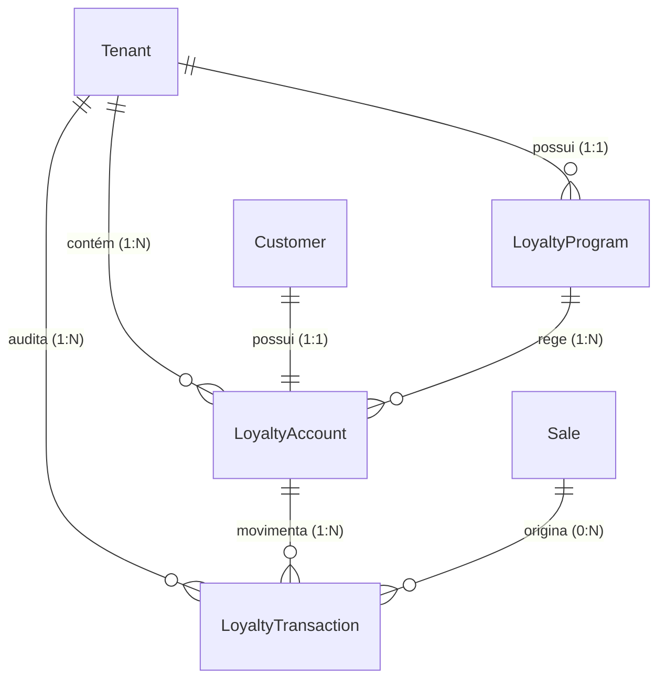

# Data Model Design: 008-loyalty-cashback

Este documento especifica a modelagem física do banco de dados para o Módulo de Fidelidade e Cashback do **Retail OS**, mapeando as tabelas e relações no Prisma ORM.

---

## 🗄️ Prisma Schema Additions

As seguintes tabelas serão adicionadas ao arquivo `apps/backend/prisma/schema.prisma`:

```prisma
// ==========================================
// PROGRAMA DE FIDELIDADE & CASHBACK (SPRINT 3)
// ==========================================

model LoyaltyProgram {
  id              String   @id @default(uuid())
  tenantId        String   @unique @map("tenant_id")
  name            String   @default("Programa de Fidelidade")
  pointsPerReal   Decimal  @default(1.00) @map("points_per_real") @db.Decimal(10, 2)
  redeemRatio     Decimal  @default(0.0100) @map("redeem_ratio") @db.Decimal(10, 4)
  minRedeemPoints Int      @default(100) @map("min_redeem_points")
  maxDiscountPct  Decimal  @default(50.00) @map("max_discount_pct") @db.Decimal(5, 2)
  expirationDays  Int?     @map("expiration_days") // v1: Sempre nulo (Never Expire)
  active          Boolean  @default(true)
  createdAt       DateTime @default(now()) @map("created_at")
  updatedAt       DateTime @updatedAt @map("updated_at")

  tenant   Tenant           @relation(fields: [tenantId], references: [id])
  accounts LoyaltyAccount[]

  @@map("loyalty_programs")
}

model LoyaltyAccount {
  id               String   @id @default(uuid())
  tenantId         String   @map("tenant_id")
  customerId       String   @map("customer_id")
  loyaltyProgramId String   @map("loyalty_program_id")
  balance          Int      @default(0)
  totalEarned      Int      @default(0) @map("total_earned")
  totalRedeemed    Int      @default(0) @map("total_redeemed")
  createdAt        DateTime @default(now()) @map("created_at")

  tenant         Tenant               @relation(fields: [tenantId], references: [id])
  customer       Customer             @relation(fields: [customerId], references: [id])
  loyaltyProgram LoyaltyProgram       @relation(fields: [loyaltyProgramId], references: [id])
  transactions   LoyaltyTransaction[]

  @@unique([tenantId, customerId])
  @@index([tenantId])
  @@map("loyalty_accounts")
}

enum LoyaltyTransactionType {
  EARN
  REDEEM
  ADJUST
}

model LoyaltyTransaction {
  id        String                 @id @default(uuid())
  tenantId  String                 @map("tenant_id")
  accountId String                 @map("account_id")
  type      LoyaltyTransactionType
  points    Int                    // Positivo para EARN/ADJUST, Negativo para REDEEM/ADJUST (débito)
  saleId    String?                @map("sale_id")
  reason    String?                @db.Text // Justificativa obrigatória para ADJUST
  createdAt DateTime               @default(now()) @map("created_at")

  tenant  Tenant         @relation(fields: [tenantId], references: [id])
  account LoyaltyAccount @relation(fields: [accountId], references: [id])
  sale    Sale?          @relation(fields: [saleId], references: [id])

  @@index([accountId])
  @@index([tenantId])
  @@map("loyalty_transactions")
}
```

---

## ⛓️ Relações e Integridade de Dados



### 1. Relação com Tenant (Multi-Tenancy)
* Cada tabela possui `tenant_id` vinculando diretamente à tabela `tenants`.
* RLS (Row Level Security) será ativado nas novas tabelas executando no banco o comando de migração:
  ```sql
  ALTER TABLE loyalty_programs ENABLE ROW LEVEL SECURITY;
  ALTER TABLE loyalty_accounts ENABLE ROW LEVEL SECURITY;
  ALTER TABLE loyalty_transactions ENABLE ROW LEVEL SECURITY;
  ```
  *(Seguido das respectivas políticas que garantem isolamento total baseado no tenant ativo da sessão)*

### 2. Relação com Cliente (Customer)
* Há uma constraint de unicidade composta `@@unique([tenant_id, customer_id])` na tabela `loyalty_accounts`. Isso garante que o mesmo cliente físico tenha **exatamente uma única conta corrente de pontos por loja**.

### 3. Relação com Vendas (Sale)
* A transação de fidelidade (`LoyaltyTransaction`) se relaciona de forma opcional (`saleId String?`) com a tabela de vendas (`sales`). Isso é fundamental para permitir o **estorno e rastreio de pontos** caso a venda original seja cancelada ou devolvida.

---

## ⚡ Índices de Performance

* **`@@unique([tenantId, customerId])` na tabela `loyalty_accounts`**: Otimiza a busca e o carregamento do saldo do cliente no PDV quando ele é identificado.
* **`@@index([accountId])` na tabela `loyalty_transactions`**: Otimiza a renderização do extrato de transações do cliente (lazy-loaded).
* **`@@index([tenantId])` em todas as tabelas**: Essencial para manter o isolamento de dados ultra-rápido durante consultas cross-tenant feitas pelo banco.
