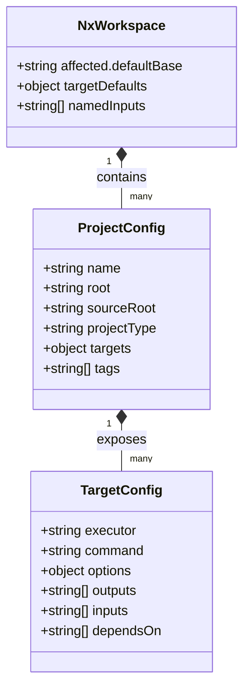
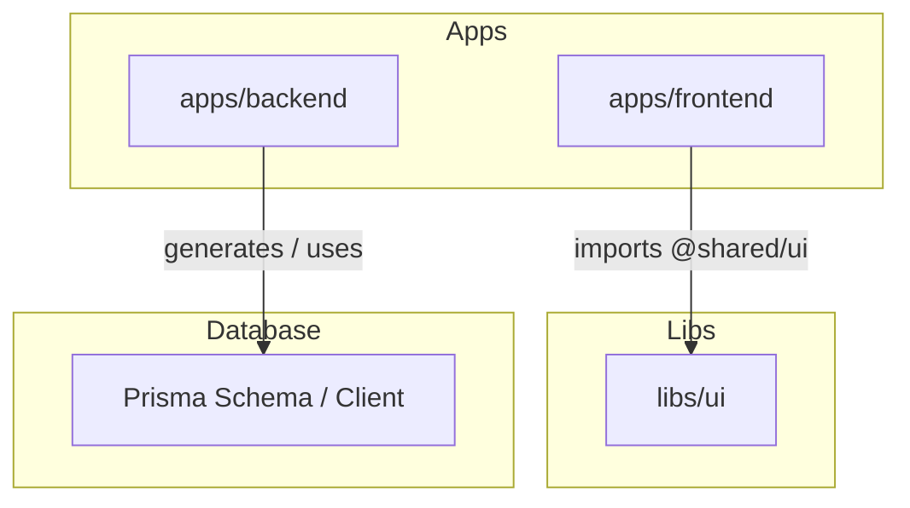

# Data Model: Configurações do Workspace Nx

**Feature**: `013-nx-monorepo-migration`  
**Data**: 2026-10-07

## 1. Entidades de Configuração do Monorepo

### 1.1 NxWorkspace (`nx.json`)
Representa a configuração global do orquestrador Nx no repositório raiz.
- `affected.defaultBase`: Ramo padrão para cálculo de projetos afetados (ex.: `main` ou `main-sdd`).
- `targetDefaults`: Regras globais de cache e dependências entre tarefas (ex.: `build` depende de `^build` para bibliotecas).
- `namedInputs`: Agrupamento de arquivos de entrada para invalidação determinística de cache.

### 1.2 ProjectConfig (`project.json`)
Presente em cada projeto do monorepo:
- `apps/frontend/project.json` (projectType: `application`)
- `apps/backend/project.json` (projectType: `application`)
- `libs/ui/project.json` (projectType: `library`)

Propriedades principais:
- `name`: Identificador único do projeto no grafo do Nx (ex.: `frontend`, `backend`, `ui`).
- `root`: Caminho relativo a partir da raiz (ex.: `apps/frontend`, `libs/ui`).
- `sourceRoot`: Diretório de código-fonte (ex.: `apps/frontend/src`, `libs/ui/src`).
- `projectType`: `"application"` ou `"library"`.
- `targets`: Mapeamento de ações executáveis (`build`, `serve`, `test`, `lint`, etc.).

### 1.3 TargetConfig
Define o comportamento de cada tarefa de um projeto:
- `command`: Comando executado no diretório do projeto.
- `inputs`: Lista de arquivos e variáveis de ambiente que afetam o resultado da tarefa.
- `outputs`: Diretórios de saída gerados pela tarefa (ex.: `{workspaceRoot}/dist/apps/frontend`).
- `cache`: Booleano que ativa ou desativa o cacheamento inteligente pelo Nx.
- `dependsOn`: Tarefas pré-requisito (ex.: `build` de `backend` pode depender de `prisma:generate`).

---

## 2. Grafo de Dependências

