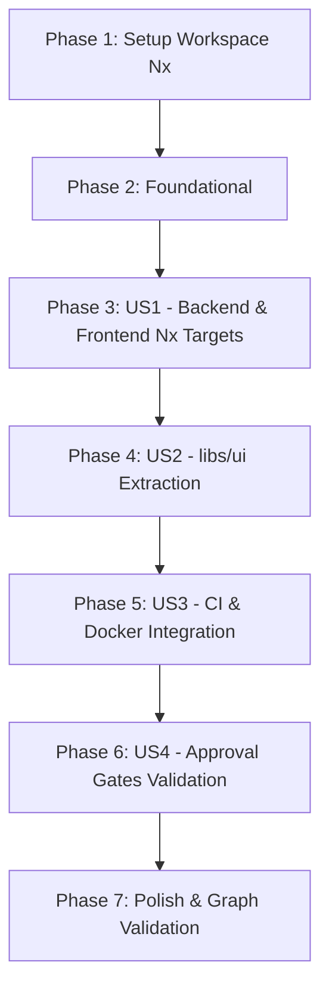

# Tasks: Migração do Repositório para Nx Monorepo

**Input**: Design documents from `specs/013-nx-monorepo-migration/` (`plan.md`, `spec.md`, `research.md`, `data-model.md`, `contracts/`, `quickstart.md`)  
**Prerequisites**: `plan.md` (concluído), `spec.md` (concluído)

## Format: `[ID] [P?] [Story] Description`

- **[P]**: Tarefas executáveis em paralelo (arquivos distintos sem dependências de bloqueio)
- **[Story]**: Identificador da User Story correspondente ([US1], [US2], [US3], [US4])
- Caminhos absolutos e exatos indicados em cada descrição

---

## Phase 1: Setup (Infraestrutura do Workspace Monorepo)

**Purpose**: Inicialização e configuração base do Nx no repositório raiz

- [x] T001 Instalar `nx` como devDependency no arquivo `package.json` raiz
- [x] T002 Criar a configuração global do Nx em `nx.json` com targetDefaults para build, test e lint
- [x] T003 [P] Criar a configuração TypeScript base em `tsconfig.base.json` com baseUrl e mapeamentos de path
- [x] T004 Atualizar scripts de execução e orquestração do monorepo no arquivo `package.json` raiz

---

## Phase 2: Foundational (Pré-requisitos de Orquestração)

**Purpose**: Estrutura de base e alinhamento do grafo para integração dos projetos

**⚠️ CRITICAL**: Nenhuma migração de app ou lib deve iniciar antes da conclusão desta fase.

- [x] T005 Limpar configurações obsoletas de hoist em `.npmrc`
- [x] T006 [P] Validar resolução do CLI do Nx executando teste de integridade na raiz com `npx nx --version`

**Checkpoint**: Fundação do workspace Nx validada e pronta para integração dos projetos.

---

## Phase 3: User Story 1 - Orquestração Unificada de Workspace com Nx (Priority: P1) 🎯 MVP

**Goal**: Permitir compilar, testar e executar as aplicações `backend` e `frontend` através de targets padronizados do Nx.

**Independent Test**: Executar `npx nx run backend:build`, `npx nx run backend:test` e `npx nx run frontend:build` garantindo compilação e testes verdes.

### Implementation for User Story 1

- [x] T007 [US1] Criar arquivo de configuração de projeto `apps/backend/project.json` com targets (`build`, `serve`, `test`, `test:cov`, `lint`, `prisma:generate`, `prisma:migrate`, `prisma:seed`)
- [x] T008 [US1] Validar execução do target de build do backend via `npx nx run backend:build`
- [x] T009 [US1] Validar execução dos testes unitários do backend via `npx nx run backend:test`
- [x] T010 [US1] Criar arquivo de configuração de projeto `apps/frontend/project.json` com targets (`build`, `serve`, `test`, `lint`)
- [x] T011 [US1] Validar execução de compilação inicial do frontend via `npx nx run frontend:build`

**Checkpoint**: Backend e Frontend integrados e operáveis via targets declarativos do Nx.

---

## Phase 4: User Story 2 - Extração e Compartilhamento da Biblioteca de UI Angular (Priority: P2)

**Goal**: Desacoplar todos os componentes visuais de `apps/frontend/src/app/shared/ui` para a biblioteca isolada `libs/ui`, consumida via `@shared/ui`.

**Independent Test**: Compilar a biblioteca `libs/ui`, compilar `apps/frontend` sem erros de importação e rodar a suíte de testes com Vitest.

### Implementation for User Story 2

- [x] T012 [US2] Criar diretório da biblioteca `libs/ui/src/` e migrar componentes, diretivas, pipes, services, styles e `tailwind.preset.js` de `apps/frontend/src/app/shared/ui`
- [x] T013 [US2] Configurar ponto de entrada público em `libs/ui/src/index.ts` exportando todos os símbolos públicos da biblioteca
- [x] T014 [US2] Criar arquivo de configuração do projeto da biblioteca em `libs/ui/project.json`
- [x] T015 [US2] Configurar paths de resolução `@shared/ui` e `@shared/ui/*` no arquivo `tsconfig.base.json` e sincronizar em `apps/frontend/tsconfig.json`
- [x] T016 [US2] Atualizar arquivo `apps/frontend/tailwind.config.js` para referenciar o preset e o caminho de conteúdo de `libs/ui`
- [x] T017 [US2] Remover pasta obsoleta `apps/frontend/src/app/shared/ui` garantindo que não restem arquivos duplicados
- [x] T018 [US2] Validar compilação do frontend consumindo `libs/ui` via `npx nx run frontend:build` e rodar testes do frontend via `npx nx run frontend:test`

**Checkpoint**: Biblioteca `libs/ui` isolada com sucesso e consumida transparentemente pelo frontend sem regressões.

---

## Phase 5: User Story 3 - Automação de CI com Detecção de Mudanças e Execução Otimizada (Priority: P3)

**Goal**: Modernizar o pipeline de CI no GitHub Actions (`.github/workflows/ci.yml`) para utilizar comandos e cache do Nx.

**Independent Test**: Simular ou validar a sintaxe do workflow e garantir que os passos do pipeline executem comandos unificados do Nx mantendo smoke tests e publicação do container de migração.

### Implementation for User Story 3

- [x] T019 [US3] Atualizar job `backend-tests` em `.github/workflows/ci.yml` para utilizar comandos Nx (`npx nx run backend:test:cov` e `npx nx run backend:build`)
- [x] T020 [US3] Atualizar job `frontend-tests` em `.github/workflows/ci.yml` para utilizar comandos Nx (`npx nx run frontend:test` e `npx nx run frontend:build`)
- [x] T021 [US3] Adaptar contexto de build e Dockerfile em `apps/frontend/Dockerfile` e `docker-compose.prod.yml` para suportar `libs/ui`
- [x] T022 [US3] Validar integridade e sintaxe completa de `.github/workflows/ci.yml`

**Checkpoint**: Pipeline de CI otimizado com suporte a Nx e compatibilidade mantida com Docker.

---

## Phase 6: User Story 4 - Execução Controlada por Etapas com Aprovação Prévia (Priority: P4)

**Goal**: Garantir governança estrita e paradas programadas para confirmação explícita do usuário a cada etapa da migração.

**Independent Test**: Verificar se cada marco de implementação solicita confirmação do usuário antes de iniciar o marco seguinte.

### Implementation for User Story 4

- [x] T023 [US4] Implementar parada com solicitação de aprovação ao término da Etapa 1 (Fundação do Monorepo Nx)
- [x] T024 [US4] Implementar parada com solicitação de aprovação ao término da Etapa 2 (Integração do Backend)
- [x] T025 [US4] Implementar parada com solicitação de aprovação ao término da Etapa 3 (Extração de libs/ui)
- [x] T026 [US4] Implementar parada com solicitação de aprovação ao término da Etapa 4 (Integração e Validação do Frontend)
- [x] T027 [US4] Implementar parada e validação final ao término da Etapa 5 (CI e Docker)

**Checkpoint**: Total conformidade com a exigência de governança e aprovações passo a passo.

---

## Phase 7: Polish & Cross-Cutting Concerns

**Purpose**: Verificação final do grafo, formatação e documentação

- [x] T028 Gerar e verificar o grafo de dependências do workspace executando `npx nx graph --file=dist/graph.json` ou exibindo resumo das relações
- [x] T029 Executar build integrado de todos os projetos com `npx nx run-many -t build`
- [x] T030 Atualizar documentação do projeto em `README.md` refletindo os comandos do novo monorepo Nx

---

## Dependencies & Execution Order

### Regras de Paralelismo
- Tarefas marcadas com **[P]** (ex.: T003, T006) podem ser executadas concomitantemente sem conflito de arquivos.
- A migração de `libs/ui` (T012-T017) deve ser concluída antes da validação final de build do frontend (T018).

---

## Estratégia de Implementação (5 Etapas com Paradas)

1. **Etapa 1**: Executar T001 a T006. **PARAR e perguntar se deseja seguir.**
2. **Etapa 2**: Executar T007 a T009. **PARAR e perguntar se deseja seguir.**
3. **Etapa 3**: Executar T012 a T018. **PARAR e perguntar se deseja seguir.**
4. **Etapa 4**: Executar T010, T011, T021. **PARAR e perguntar se deseja seguir.**
5. **Etapa 5**: Executar T019, T020, T022, T028 a T030. **PARAR e apresentar relatório final.**
