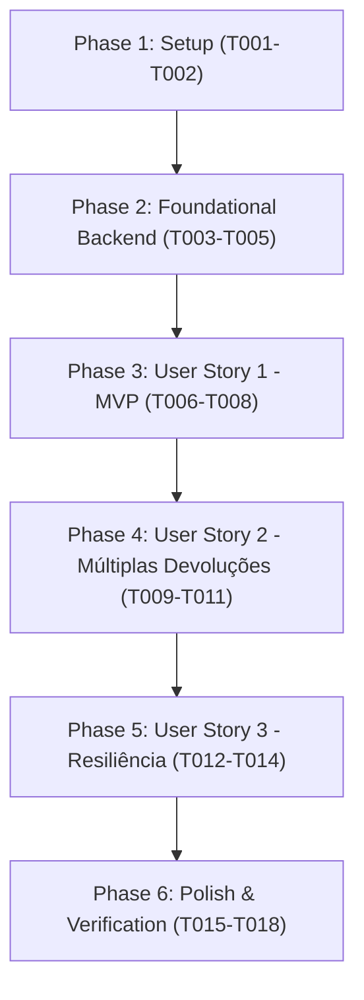

# Tasks: Detalhamento de Devoluções na Modal de Venda

**Input**: Design documents from `/specs/014-sale-detail-returns/`  
**Prerequisites**: plan.md (required), spec.md (required), research.md, data-model.md, contracts/, quickstart.md  

## Format: `[ID] [P?] [Story] Description`

- **[P]**: Tarefa paralelizada (arquivos independentes, sem bloqueios mútuos)
- **[Story]**: Identificador da User Story correspondente (`[US1]`, `[US2]`, `[US3]`)
- Todos os caminhos de arquivos são explícitos e absolutos em relação ao monorepo

---

## Phase 1: Setup (Shared Infrastructure & Types)

**Purpose**: Definição dos tipos de dados e contratos compartilhados para suportar o detalhamento de devoluções.

- [x] T001 Atualizar contratos de saída em `apps/backend/src/application/use-cases/sales/common/sale-output.ts` adicionando o tipo `ReturnItemSummaryOutput` e enriquecendo `ReturnSummaryOutput` com `refundType`, `reason` e `items`
- [x] T002 [P] Atualizar interface de modelo `Sale` e `ReturnSummary` em `apps/frontend/src/app/core/models/sale.model.ts` adicionando `ReturnItemSummary` com atributos de produto, condição, quantidade e valores

---

## Phase 2: Foundational (Backend Data Access & Presenter)

**Purpose**: Infraestrutura de persistência e serialização na API para entregar devoluções com itens agregados à venda.

**⚠️ CRITICAL**: Pré-requisito para disponibilizar os dados necessários ao frontend.

- [x] T003 Atualizar consulta `findById` em `apps/backend/src/infrastructure/persistence/repositories/prisma-sale.repository.ts` para incluir a relação `returnOrders.items` com `product: { select: { name: true, sku: true } }`
- [x] T004 Atualizar mapeamentos em `apps/backend/src/infrastructure/presenters/sale.presenter.ts` para criar `ReturnItemSummaryPresenter` e serializar itens dentro de `ReturnSummaryPresenter`
- [x] T005 [P] Criar/atualizar testes unitários em `apps/backend/src/application/use-cases/sales/__tests__/get-sale.use-case.spec.ts` validando a inclusão de itens na devolução retornada por `GetSaleUseCase`

**Checkpoint**: Backend preparado e testado — endpoint `GET /api/v1/sales/:id` retorna as devoluções com seus itens detalhados.

---

## Phase 3: User Story 1 - Visualização de Devoluções em Lista Detalhada (Priority: P1) 🎯 MVP

**Goal**: Permitir que operadores de caixa e gerentes visualizem a lista detalhada de devoluções e produtos devolvidos na modal de detalhes da venda.

**Independent Test**: Abrir os detalhes de uma venda que possui devoluções registradas e confirmar a exibição da lista com status, modalidade, motivo e itens devolvidos (nome, SKU, quantidade, preço e condição física).

### Implementation for User Story 1

- [x] T006 [US1] Adicionar helpers e sinais reativos de formatação (status variants, condição do item e tipos de reembolso) em `apps/frontend/src/app/features/sales/components/sale-detail-modal/sale-detail-modal.component.ts`
- [x] T007 [US1] Reestruturar a seção de devoluções no template `apps/frontend/src/app/features/sales/components/sale-detail-modal/sale-detail-modal.component.html` para exibir cartões de devolução com tabela/grid dos itens devolvidos (produto, SKU, quantidade, preço unitário, total e badge de condição)
- [x] T008 [US1] Atualizar testes unitários em `apps/frontend/src/app/features/sales/components/sale-detail-modal/sale-detail-modal.component.spec.ts` validando a renderização correta da lista detalhada de devoluções e seus itens

**Checkpoint**: User Story 1 completa e funcional de forma autônoma como MVP.

---

## Phase 4: User Story 2 - Navegação Clara e Estado Visual de Múltiplas Devoluções (Priority: P2)

**Goal**: Garantir ergonomia visual e navegação clara quando a venda possui múltiplas devoluções, permitindo expandir/recolher itens e ver total consolidado.

**Independent Test**: Abrir venda com mais de uma devolução, alternar entre expansão/recolhimento e verificar o indicador de total já reembolsado em relação ao total da venda.

### Implementation for User Story 2

- [x] T009 [US2] Implementar controle de expansão/recolhimento (accordion/toggle) por devolução em `apps/frontend/src/app/features/sales/components/sale-detail-modal/sale-detail-modal.component.ts` e `apps/frontend/src/app/features/sales/components/sale-detail-modal/sale-detail-modal.component.html`
- [x] T010 [US2] Adicionar indicador consolidado de valor total devolvido em relação ao total original da venda no template `apps/frontend/src/app/features/sales/components/sale-detail-modal/sale-detail-modal.component.html`
- [x] T011 [US2] Adicionar testes unitários em `apps/frontend/src/app/features/sales/components/sale-detail-modal/sale-detail-modal.component.spec.ts` validando alternância de expansão e consistência dos cálculos consolidados

**Checkpoint**: User Story 2 completa, com navegação refinada para múltiplos registros.

---

## Phase 5: User Story 3 - Tratamento de Vendas sem Devoluções e Resiliência (Priority: P3)

**Goal**: Garantir que vendas sem devoluções apresentem visual enxuto e que erros/dados ausentes sejam tratados de forma resiliente.

**Independent Test**: Abrir uma venda sem devoluções e confirmar que a tela permanece limpa e focada nos itens e pagamentos, sem avisos desnecessários ou falhas de renderização.

### Implementation for User Story 3

- [x] T012 [US3] Assegurar que o bloco de devoluções detalhadas é omitido quando a venda não possui devoluções (`returns.length === 0` ou `undefined`) no template `apps/frontend/src/app/features/sales/components/sale-detail-modal/sale-detail-modal.component.html`
- [x] T013 [US3] Implementar tratamento de fallback e valores padrão para dados legados sem itens de devolução em `apps/frontend/src/app/features/sales/components/sale-detail-modal/sale-detail-modal.component.ts`
- [x] T014 [US3] Adicionar casos de teste em `apps/frontend/src/app/features/sales/components/sale-detail-modal/sale-detail-modal.component.spec.ts` cobrindo vendas sem devoluções e payloads resilientes

**Checkpoint**: Todas as user stories finalizadas com tratamento de casos de borda e resiliência.

---

## Phase 6: Polish & Cross-Cutting Concerns

**Purpose**: Verificação de qualidade, testes de regressão e garantia de acessibilidade.

- [x] T015 [P] Executar suite de testes e linter do backend (`npx nx test backend` e `npx nx lint backend`)
- [x] T016 [P] Executar suite de testes e linter do frontend (`npx nx test frontend` e `npx nx lint frontend`)
- [x] T017 Validar conformidade de acessibilidade (foco de teclado, contraste de badges e leitor de tela nos itens devolvidos conforme WCAG 2.2) em `apps/frontend/src/app/features/sales/components/sale-detail-modal/sale-detail-modal.component.html`
- [x] T018 Executar validação de ponta a ponta seguindo o roteiro de [quickstart.md](./quickstart.md)

---

## Dependencies & Completion Order

---

## Parallel Execution Opportunities

- **T001 & T002**: Definição de tipos no backend e frontend executadas.
- **T004 & T005**: Mapper/Presenter e testes de use case no backend executados.
- **T015 & T016**: Testes e linters do backend e frontend executados via Nx.

---

## Implementation Strategy (MVP First)

1. **Incremento 1 (MVP)**: Entregar Phase 1, Phase 2 e Phase 3 (US1) — itens devolvidos visíveis na modal de detalhes.
2. **Incremento 2**: Implementar Phase 4 (US2) para otimizar vendas com múltiplas devoluções e totais consolidados.
3. **Incremento 3**: Implementar Phase 5 (US3) e Phase 6 para blindar casos de borda, acessibilidade e validação de qualidade global.
